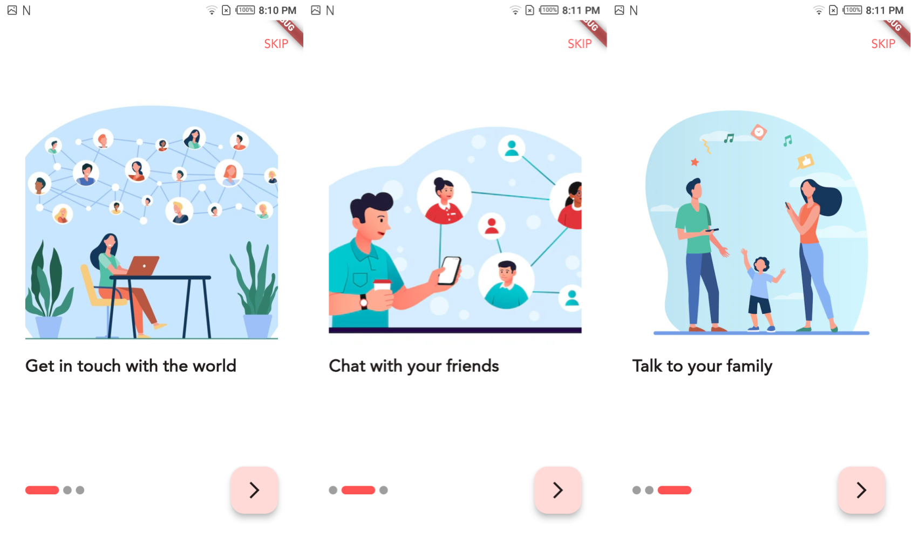
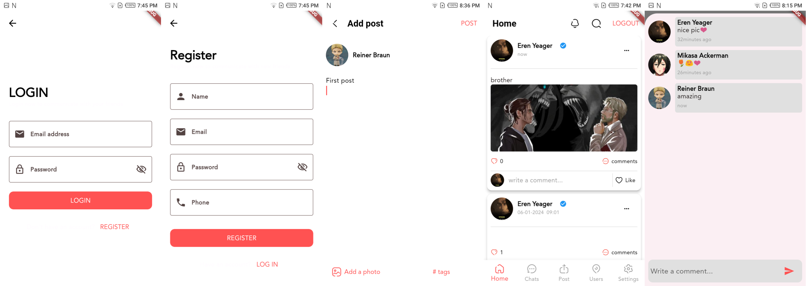
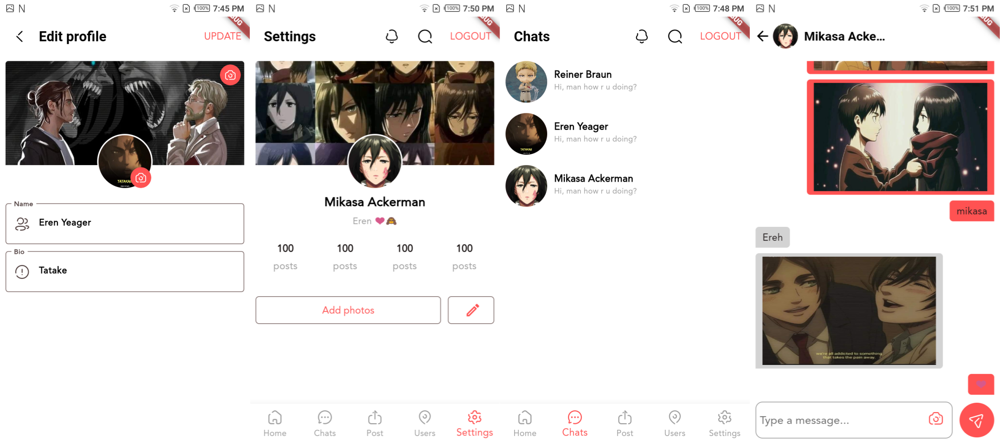

# first_flutter

This is my first fluter project, i was practicing flutter throw a udemy course and some projects.
one of the these projects is simple social app whaich i developed without the course, i just used the UI from the course and added some features.
## Social app

It's a social app that has features like : 
 - add posts, comments, chattings

Used tools: 
 - Firebase : to sotre the data of users and their images in additon to using the realtime database for the chats.
 - Bloc : for state mangement
 - Shared prefrences : to store simple data.
 - blur hash: this used to generate hash value for images so when the images is still loading it shows a blur image for it.

##Here are some screenshots of the app

